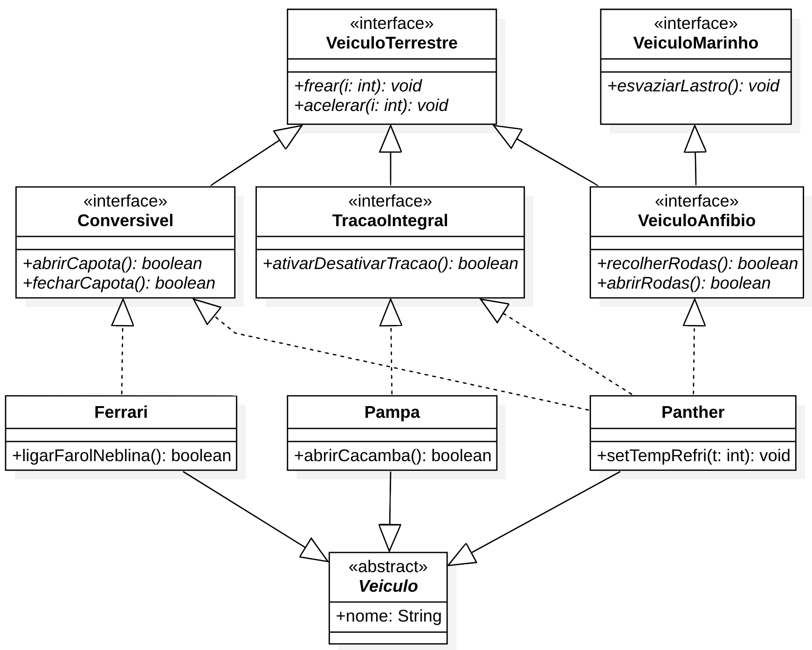

# Prática com herança e polimorfismo em Java

Nesse repositório existe um esqueleto funcional de um projeto (feito em gradle com o IntelliJ IDEA 2018.2) para prática dos conceitos de herança e polimorfismo em Java.

A partir desse esqueleto, faça modificações no projeto para atender as seguintes regras de negócio:

-   Só é possível abrir a caçamba se o carro estiver parado
-   Só é possível ativar ou desativar a tração integral se o veículo estiver parado
-   Só é possível ativar a tração integral se o veículo anfíbio estiver com as rodas abertas
-   Só é possível abrir ou fechar a capota se o carro estiver parado, com exceção da Ferrari, pois essa permite fazer isso se a velocidade estiver abaixo dos 20km/h
-   Ao recolher as rodas é necessário esvaziar o lastro
-   Se necessário, modifique a hierarquia de classes para melhorar o projeto
-   Faça testes de unidade para todos os métodos de todas as classes

O [diagrama UML](diagrama-UML/veiculos-polimorfismo.mdj) foi feito com o aplicativo [StarUML](https://staruml.io).